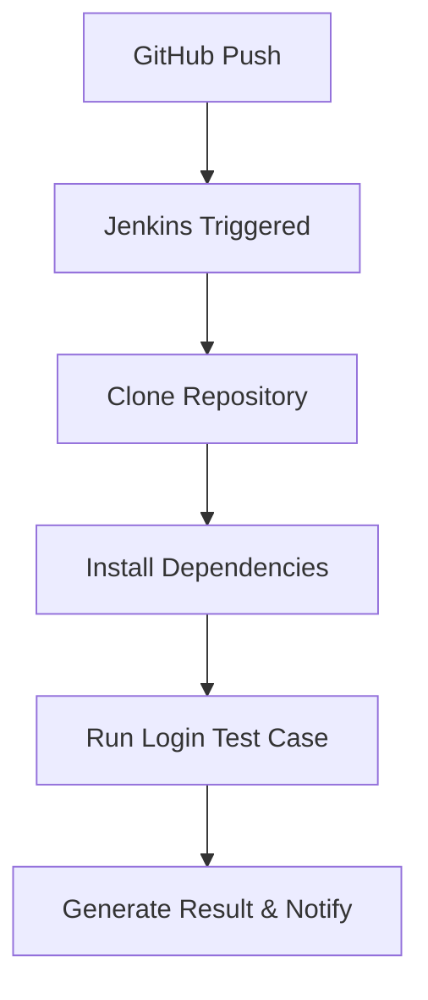

## Jenkins and GitHub Integration

* Create Jenkins project - Free Style Project and Jenkins Pipeline
* Introduction to Git & GitHub
* Demonstration of using Jenkins with GitHub Repository Jenkins Pipeline
* Creating a Jenkins Pipeline
* Mini-Project using Jenkins

---

## 1. Create Jenkins Projects

### 1.1 Free Style Project

**Steps:**
1. Open Jenkins dashboard.
2. Click on **"New Item"**.
3. Enter a project name.
4. Select **"Freestyle project"** and click **OK**.
5. Configure the following:
   - **Source Code Management**: Git → Add GitHub repository URL.
   - **Build Triggers**: Choose *Poll SCM* or *GitHub hook trigger*.
   - **Build**: Add shell commands or build steps (e.g., compile Java code, run tests).
6. Save and click **Build Now**.

**Example:**
```bash
echo "Compiling..."
javac HelloWorld.java
echo "Running..."
java HelloWorld
````

---

### 1.2 Pipeline Project

**Steps:**

1. Click on **"New Item"** → Enter name.
2. Select **"Pipeline"** and click **OK**.
3. Scroll to the **Pipeline** section and choose:

   * Script → Paste the pipeline code.
   * Or choose SCM → Git → Paste GitHub Repo URL.
4. Save and **Build Now**.

---

## 2. Jenkins with GitHub Repository

**Integrate GitHub repository with Jenkins:**

### Prerequisites:

* GitHub account and repository.
* Jenkins with Git plugin.
* Jenkins GitHub integration plugin installed.

**Steps:**

1. In your GitHub repository:

   * Go to **Settings > Webhooks**.
   * Add the Jenkins URL followed by `/github-webhook/` (e.g., `http://<jenkins-ip>:8080/github-webhook/`).
   * Choose `application/json`, and trigger on push events.

2. In Jenkins Pipeline:

   * Use GitHub repository in **Source Code Management**.
   * Enable **GitHub hook trigger for GITScm polling**.

---

## 3. Creating a Jenkins Pipeline

Jenkins pipelines are used to define the stages of your CI/CD process using code.

### 3.1 Declarative Pipeline Example

```groovy
pipeline {
    agent any
    stages {
        stage('Clone') {
            steps {
                git 'https://github.com/username/sample-project.git'
            }
        }
        stage('Build') {
            steps {
                echo 'Building the code...'
                sh 'javac HelloWorld.java'
            }
        }
        stage('Test') {
            steps {
                echo 'Running tests...'
                sh 'java HelloWorld'
            }
        }
    }
}
```

---

## 4. Mini Project using Jenkins

This project demonstrates how to automate a single **login validation test case** using **Selenium WebDriver with Python**, executed via a **Jenkins Pipeline**. It integrates Jenkins with GitHub to achieve Continuous Integration (CI).

---

## 1. 🎯 Project Objective

- Automate login functionality for a demo application.
- Run the test automatically via Jenkins Pipeline.
- Display test results and logs in Jenkins.
- Enable integration with GitHub for CI on code push.

---

## 2. ⚙️ Tech Stack

- **Language**: Python 3
- **Automation**: Selenium WebDriver
- **CI Tool**: Jenkins
- **SCM**: GitHub
- **Browser**: Chrome (via ChromeDriver)

---

## 3. 📁 Project Structure

```

login-automation-pipeline/
│
├── tests/
│   └── test\_login.py
├── requirements.txt
├── Jenkinsfile
└── README.md

````

### `test_login.py`

```python
from selenium import webdriver
from selenium.webdriver.common.by import By

def test_login():
    driver = webdriver.Chrome()
    driver.get("https://www.saucedemo.com/")
    driver.find_element(By.ID, "user-name").send_keys("standard_user")
    driver.find_element(By.ID, "password").send_keys("secret_sauce")
    driver.find_element(By.ID, "login-button").click()
    assert "inventory" in driver.current_url
    driver.quit()
````

### `requirements.txt`

```
selenium==4.15.2
```

---

## 4. 🧩 Jenkins Pipeline Configuration

### ✅ Steps

1. Create a **New Item** → Select **Pipeline**.
2. In the **Pipeline script** section, use the following:

### `Jenkinsfile`

```groovy
pipeline {
    agent any

    tools {
        python 'Python3'  // Add Python tool in Jenkins if not available
    }

    stages {
        stage('Clone Repo') {
            steps {
                git 'https://github.com/your-username/login-automation-pipeline.git'
            }
        }

        stage('Install Dependencies') {
            steps {
                sh 'pip install -r requirements.txt'
            }
        }

        stage('Run Login Test') {
            steps {
                sh 'python3 tests/test_login.py'
            }
        }
    }

    post {
        always {
            echo 'Pipeline execution completed.'
        }
        failure {
            echo 'Login Test Failed!'
        }
    }
}
```

---

## 5. 🔗 GitHub Integration with Jenkins

### ✅ Webhook Setup

1. In GitHub repo: `Settings → Webhooks → Add webhook`
2. Payload URL: `http://<your-jenkins-url>/github-webhook/`
3. Content type: `application/json`
4. Events: Choose "Just the push event"
5. Save webhook

### ✅ Jenkins Job Setup

* In the job configuration:

  * Select **GitHub project** → Paste repo URL.
  * In **Build Triggers** → Enable *GitHub hook trigger for GITScm polling*.

---

## 6. 🔄 Pipeline Execution Flow



---

## 7. 📤 Sample Output in Jenkins Console

```
Started by GitHub push...
[Pipeline] Start of Pipeline
Cloning repository...
Installing dependencies...
Running test_login.py...
✅ Test Passed! User successfully logged in.
[Pipeline] End of Pipeline
Finished: SUCCESS
```
---
### Outcome:

* Code is pulled from GitHub automatically.
* Code is compiled and tested on Jenkins.
* Build status shown in Jenkins dashboard.

---

